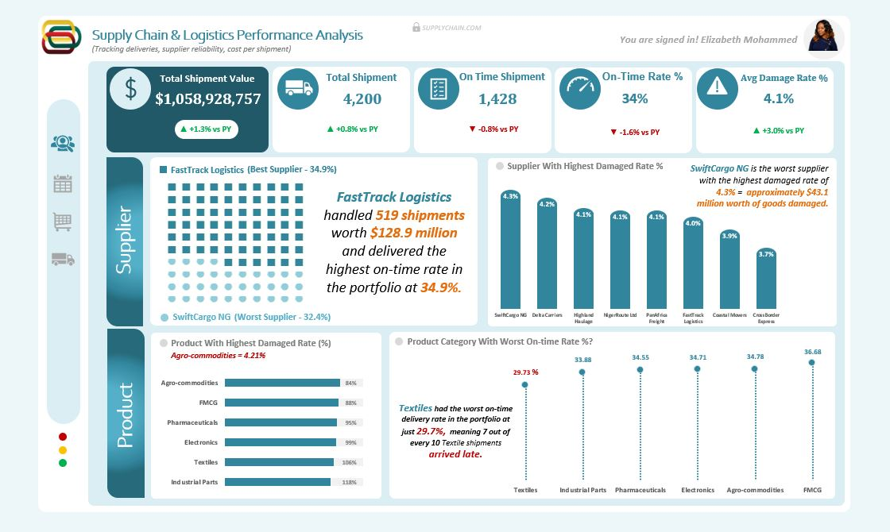
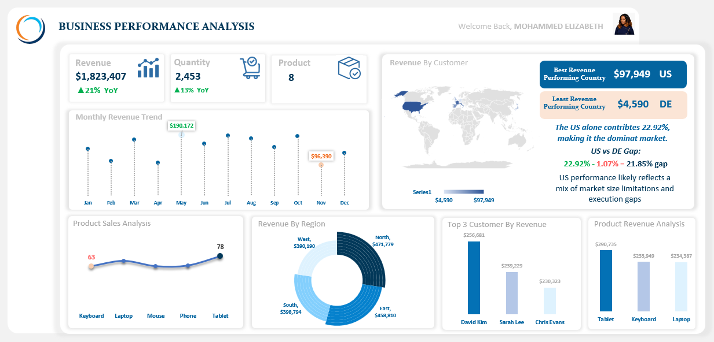
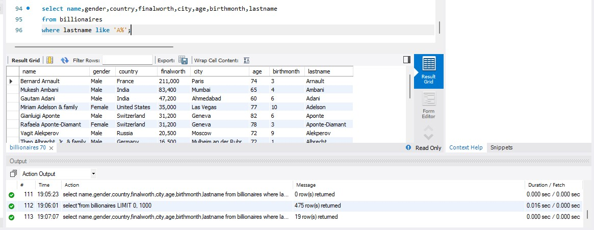

## ABOUT ME

I'm Mohammed Elizabeth, a Data and Insights Analyst and Data Analytics Instructor at HOUSE OF DATA, where I work across two tracks: building analytical solutions that help organizations make smarter decisions, and teaching the next generation of analysts how to think about data the right way.

On the analyst side, I turn raw datasets into structured insights that connect directly to business strategy. My focus is always the same: make sure the people acting on data understand not just what the numbers say, but what they mean and what to do next.
On the instruction side, I teach Excel, Power BI, SQL, and Tableau with an emphasis on real world application over theory, working through real business problems with real data, the same standard I hold my own work to.

I am particularly drawn to executive dashboard development, where the challenge is not just technical but communicative: how do you take hundreds of variables and present them in a way a business leader can read in sixty seconds and walk away knowing exactly where to focus?
That is where I do my best work.

<!--Mention your top/relevant skills here - core and soft skills-->

## Technical Skills

•	**Advanced Excel** — Power Query, Power Pivot, DAX measures, star schema and snowflake modeling, dedicated date tables, PivotTables, conditional formatting, and executive dashboard design

•	**Power BI** — Power Query transformation, DAX measures, data modeling, KPI card design, interactive visuals, and executive dashboard development

•	**SQL** — data extraction, filtering, aggregation, and analysis across relational databases

•	**Tableau** — data visualization, interactive dashboard development, and business performance reporting

•	**Core Analytics** — data cleaning and transformation, KPI development, revenue and profitability analysis, customer segmentation, time series and YoY analysis, gap analysis, and data storytelling

•	**Teaching and Instruction** — data analytics curriculum delivery, practical project based teaching across Excel, Power BI, SQL, and Tableau, and mentoring early stage analysts through real business problems

## Soft Skills

•	**Analytical Thinking** — I look for patterns that are not obvious and connections between metrics that do not show up in a single chart, the kind of findings that actually change how a decision gets made.

•	**Business Acumen** — I frame every analysis around what leadership needs to know, not what is easiest to measure.

•	**Clear Communication** — I translate technical findings into plain language so the audience understands the insight without needing to understand the process behind it.

•	**Attention to Detail** — I verify every figure against source data before it goes anywhere near a stakeholder, because one wrong number can undermine trust in everything else on a dashboard.

•	**Curiosity** — I am always looking for a better query, a cleaner model, or a more intuitive way to present a finding.


<!--Section 2: List 3-4 key projects-->
## MY PROJECTS

**Case Study 1 - Restaurant Sales Intelligence: Customer Demand Analysis, Revenue Optimization, and Seasonal Performance Analytics.**


  


**Tech Stack:** Excel, Power Query, Power Pivot, DAX, Star Schema and Snowflake Modeling, Calculated Columns

Data was transformed using Power Query, then modeled in Power Pivot using a combination of star schema and snowflake schema design, supported by a dedicated date table built for time series analysis. DAX measures and calculated columns powered the KPI cards and the quarterly, monthly, and day of week breakdowns, while PivotTables brought it all together into the dashboard.

**Business Problem**

The restaurant needed visibility into which menu items, days, and time periods drove the most revenue and demand, so leadership could plan staffing, inventory, and promotions around real customer behavior instead of guesswork.

**Executive Summary**

I built a Restaurant Performance Dashboard that tracks revenue, transactions, quantity sold, and customer activity across the year, broken down by menu item, quarter, month, and day of week.

The analysis found $349,926 in revenue across 17,534 transactions and 52,844 items sold, and surfaced clear patterns in which menu items, days, and periods drive the most business.

**Key Insights**

**Revenue and Transaction Baseline**

- Total Revenue: $349,926
- Total Transactions: 17,534
- Total Quantity Sold: 52,844
- Total Customers: 100

Each transaction averages about $19.95 in revenue and roughly 3 items, giving the business a clear baseline to track if average order size or value shifts over time.

**Grilled Chicken Leads Menu Demand**

- Grilled Chicken: $12,854, the highest demand item
- Vegetarian Platter: $5,706, the lowest labeled demand item

Grilled Chicken generates more than double the demand of the Vegetarian Platter, making it the clear anchor item on the menu and a logical focus for the current 50% off promotion shown on the dashboard.

**Revenue Holds Steady Across Quarters**

- Q1: $86,175
- Q2: $89,747
- Q3: $87,672
- Q4: $86,333

Quarterly revenue stays within about $3,600 of each other across the year, with Q2 the strongest and Q1 the weakest, which points to steady demand rather than sharp seasonal swings.

**2023 Outpaced 2022 in July but Fell Behind in September**

- July: 2023 sales reached 105.53% of 2022 levels
- September: 2023 sales fell to 94.51% of 2022 levels

July stands out as the strongest month of growth versus the prior year, while September is the one labeled month where 2023 underperformed 2022, a gap worth digging into since every other labeled month points to growth.

**Friday Drives the Most Transactions, Sunday Drives the Most Revenue**

- Peak Transaction Day: Friday, 2,531
- Lowest Transaction Day: Sunday, 2,483
- Peak Revenue Day: Sunday, $51,088
- Lowest Revenue Day: Wednesday, $48,454

Friday brings in the highest transaction count, but Sunday brings in the highest revenue despite having the lowest transaction count in the week. That gap points to customers spending more per visit on Sundays, likely larger groups, higher priced orders, or both.

**Monthly Transaction Volume Stays in a Narrow Band**

- Highest Month: 1,554 transactions
- Lowest Month: 1,448 transactions

Monthly transaction volume moves within a relatively narrow range across the year, which points to steady month to month demand rather than sharp seasonal spikes.

**Recommendations**

1. Expand the Grilled Chicken promotion or use it as a gateway item to cross sell other menu items, since it already leads demand by a wide margin over items like the Vegetarian Platter.
2. Investigate what changed in September that caused 2023 sales to fall behind 2022, since every other labeled month points to growth.
3. Staff and prep more heavily for Friday given its lead in transaction volume, while reviewing Sunday service for upsell opportunities given its higher revenue despite fewer transactions.
4. Test menu or promotion changes on Wednesday, since it consistently lags the rest of the week on revenue.
5. Test bundling or upsell prompts to lift the average order size beyond its current $19.95 across roughly 3 items per transaction.
6. Track quarterly revenue consistency going forward, since the current spread of about $3,600 between the strongest and weakest quarter suggests stable demand worth protecting rather than seasonal swings worth chasing.
   

**Business Impact Statement**

I built a Restaurant Performance Dashboard in Excel that tracks revenue, transactions, quantity, and customer activity across menu items, quarters, months, and days of the week. The analysis covered $349,926 in revenue across 17,534 transactions, identified Grilled Chicken as the top demand item, and surfaced a meaningful gap between Friday's transaction volume and Sunday's revenue lead. It gives restaurant leadership a clear view of where demand and revenue actually come from, down to the day of the week, instead of relying on instinct alone.


**Case Study 2 - An Advanced RFM Analytics Solution - (Customer Retention Intelligence).**

..JPG)


**Tech Stack:** Excel, Power Query, Power Pivot, DAX, PivotTables, Conditional Formatting, Data Modelling, RFM Scoring.

I transfomed the customer data and loaded it using Power Query, then modeled in Power Pivot. RFM scores were calculated using the PERCENTILE function on a 1 to 10 scale for recency, frequency, and monetary value, then combined to classify customers into High Value, Active, At Risk, and Churned segments. DAX measures powered the year over year revenue comparison and the segment level metrics, while PivotTables and conditional formatting were used to build out the dashboard. I also did a data modelling using the star-schema and snowflakes.

**Business Problem**

The business lacked visibility into customer value, churn risk, and revenue concentration, even as overall revenue declined year over year. Leadership needed a clear way to identify high value customers, reduce churn, and uncover growth opportunities through customer segmentation.

**Executive Summary**

Using Excel and the RFM (Recency, Frequency, Monetary) framework, I built a Customer Retention Intelligence Dashboard that analyzed 1,794 customers across a five year period from 2019 to 2024. Total revenue stood at $6.44M, down 6.3% from the prior year. The analysis identified $1.55M in revenue at churn risk, uncovered 94 upsell opportunities, and showed that a small segment of customers drives most of the business's revenue.

**Key Insights**

**Revenue Is Declining Year Over Year**

- Total Revenue: $6,440,115 ($6.44M)
- Year over Year Change: -6.3% vs Prior Year

Revenue fell 6.3% compared to the prior year, the exact trend this RFM analysis was built to explain and reverse.

**High Value Customers Drive a Third of Revenue**

- Revenue: $2.20M
- Customers: 334
- Revenue Contribution: 34.22%

Only 18.62% of customers generate over a third of total revenue, which makes retaining this group a top priority.

**At Risk Customers Carry $1.55M in Exposure**

- Revenue at Risk: $1.55M
- Customers: 580
- Revenue Share: 24.10%

Nearly one third of customers, 32.33% of the base, show signs of declining engagement, creating a real revenue recovery opportunity if they are re engaged before they churn.

**Churn Has Already Cost the Business $484,741**

- Churned Customers: 362
- Revenue Lost: $484,741

More than 20% of customers, 20.18% of the base, have already disengaged, taking nearly half a million dollars in revenue with them.

**Revenue Is Concentrated Among a Small Group**

- Top 20% of customers generate 67.1% of total revenue

The business follows a classic Pareto pattern, which means it depends heavily on a relatively small group of high value customers.

**Upsell Opportunities Exist**

- 94 customers were identified as strong candidates for upselling and cross selling.

These 94 customers already show strong engagement, which makes them the fastest path to additional revenue without acquiring new customers.

**Churn Spiked in February and Eased in January**

- Highest Churn Increase: February (+18.0%)
- Largest Churn Reduction: January (-8.9%)

Churn moves up and down throughout the year, which means retention campaigns need to target specific high risk months rather than running at a constant pace year round.

**Recommendations**

1. Build a VIP retention program for the high value customers who contribute 34.22% of revenue.
2. Launch targeted recovery campaigns for the 580 at risk customers representing $1.55M in revenue.
3. Set up predictive churn monitoring with automated retention alerts.
4. Run personalized upsell campaigns for the 94 high potential customers.
5. Reduce revenue concentration risk by increasing engagement among Active and At Risk customers, the two largest segments outside the High Value group.


**Business Impact Statement**

I built an RFM based Customer Retention Intelligence Dashboard in Excel that segmented 1,794 customers into four groups based on recency, frequency, and monetary value. The dashboard identified $1.55M in at risk revenue, uncovered 94 upsell opportunities, and showed that the top 20% of customers generate 67.1% of total revenue. It gives leadership a clear view of where to focus retention efforts and where revenue is most exposed, backed by segment level evidence rather than guesswork.


**Case Study 3 - Data-Driven Supply Chain Optimization: Supplier Performance, Delivery Reliability, and Risk Management.**




**Tech Stack:** Power BI, Power Query, DAX, Star Schema and Snowflake Modeling, Comprehensive Date Table


**Business Problem**

The business needed visibility into supplier reliability, on-time delivery performance, and damage rates across its supply chain to understand where shipments were falling short and which suppliers and product categories carried the most risk.

**Executive Summary**

I built a Supply Chain and Logistics Performance Dashboard that tracks $1.06 billion in shipment value across 4,200 shipments, broken down by supplier reliability, product category, on-time delivery, and damage rate.

The analysis found that only 34% of shipments arrive on time across the entire portfolio, a problem that holds true even for the best performing supplier and product category, while damage rates stay fairly consistent around 4% regardless of supplier or product.

**Key Insights**

**On-Time Delivery Is a Business Wide Problem**

- Total Shipments: 4,200, up 0.8% from last year
- On Time Shipments: 1,428, down 0.8% from last year
- On-Time Rate: 34%, down 1.6% from last year

Shipment volume grew slightly year over year, but on-time shipments actually fell, which means delivery performance is slipping even as the business ships more. This is not isolated to one supplier or category either, the best performing supplier still only reaches a 34.9% on-time rate, which means roughly two out of every three shipments across the portfolio arrive late.

**FastTrack Logistics Leads on Reliability**

- Shipments Handled: 519
- Shipment Value: $128.9M
- On-Time Rate: 34.9%

FastTrack Logistics delivers the highest on-time rate in the portfolio at 34.9%, only slightly above the 34% average, which shows that even the strongest supplier is operating in roughly the same underperforming range as everyone else.

**SwiftCargo NG Underperforms on Both Speed and Damage**

- On-Time Rate: 32.4%, the worst in the portfolio
- Damage Rate: 4.3%, the highest in the portfolio, equal to about $43.1M in damaged goods

SwiftCargo NG ranks worst on both on-time rate and damage rate, but the gap between SwiftCargo NG and the best supplier is only 2.5 percentage points on time and 0.6 percentage points on damage, which points to company wide inconsistency rather than one bad supplier.

**Damage Rates Stay Tight Across Suppliers and Products**

- Highest Supplier Damage Rate: SwiftCargo NG, 4.3%
- Lowest Supplier Damage Rate: Cross Border Express, 3.7%
- Highest Product Damage Rate: Agro-commodities, 4.21%
- Lowest Product Damage Rate: Industrial Parts, 3.87%

Damage rates cluster tightly around the 4.1% portfolio average no matter which supplier or product is involved, which points to a shared operational cause such as handling or packaging rather than a single weak link.

**Textiles Has the Worst On-Time Performance of Any Product Category**

- Textiles: 29.73% on time
- Industrial Parts: 33.88% on time
- Pharmaceuticals: 34.55% on time
- Electronics: 34.71% on time
- Agro-commodities: 34.78% on time
- FMCG: 36.68% on time

Textiles shipments arrive late about 7 out of every 10 times, the worst on-time rate of any category, while even FMCG, the best performing category, still arrives late more than 6 out of every 10 times.

**Agro-commodities Carries the Highest Product Damage Risk**

- Agro-commodities: 4.21%
- FMCG: 4.17%
- Pharmaceuticals: 4.10%
- Electronics: 4.06%
- Textiles: 3.99%
- Industrial Parts: 3.87%

Agro-commodities combines a high damage rate with one of the stronger on-time rates, while Textiles shows the opposite pattern, holding up fine on damage but falling badly on speed, which means damage and delay are likely driven by different root causes.

**Recommendations**

1. Treat the 34% on-time rate as a company wide issue rather than a supplier specific one, since even the best supplier and best product category still miss the on-time target most of the time.
2. Investigate the root cause of late Textiles shipments specifically, given a 29.73% on-time rate means most of this category arrives late.
3. Audit packaging and handling processes across all suppliers, since the consistently tight 3.7% to 4.3% damage rate range points to a shared process issue rather than one supplier's fault.
4. Review SwiftCargo NG's operations directly, since it ranks worst on both on-time rate and damage rate, even though the gap to other suppliers is small.
5. Study what FastTrack Logistics does differently to reach a 34.9% on-time rate, and test whether that approach can be applied to other suppliers.
6. Set a clear on-time delivery target and track progress against it monthly, since the current 34% rate leaves substantial room for improvement before reaching an acceptable service level.


**Business Impact Statement**

I built a Supply Chain and Logistics Performance Dashboard that tracks $1.06 billion in shipment value and 4,200 shipments across supplier, product, on-time delivery, and damage rate metrics. The analysis found that only 34% of shipments arrive on time across the entire portfolio, a gap that holds even for the best performing supplier and product category, while damage rates stay consistent around 4% regardless of supplier or product. It gives logistics leadership a clear view of where delivery and damage problems start, and a way to track progress as fixes get put in place.


**Case Study 4 - A Multi-Dimensional Business Intelligence Analysis of Revenue Trends, Sales Team Effectiveness, Product Performance, and Geographic Market Contribution.**




**Tech Stack:** Excel, Power Query, Power Pivot, DAX, Star Schema and Snowflake Modeling, Calculated Columns, PivotTables, Conditional Formatting

Data was transformed and loaded using Power Query, then modeled in Power Pivot using a combination of star schema and snowflake schema design, supported by a dedicated date table built for time series analysis. DAX measures and calculated columns powered the YoY growth calculations, regional breakdowns, customer revenue rankings, and product level performance metrics, while PivotTables brought it all together into the dashboard.

**Business Problem**

The business needed a consolidated view of revenue performance, product demand, regional contribution, and customer value to understand where growth was coming from and which markets, products, and customers were driving the most impact.

**Executive Summary**

I built a Business Performance Analysis Dashboard that tracks revenue, quantity sold, product performance, regional distribution, and top customer contribution across the year.

The analysis found $1.82M in revenue across 2,453 units sold, with revenue up 21% and quantity up 13% year over year. The dashboard identified the North region and the US as the strongest performing market, Tablet as the top revenue and volume product, and David Kim as the highest value customer, while also flagging a sharp mid year revenue dip that pulled November to the lowest monthly figure of the year.

**Key Insights**

**Revenue and Volume Are Both Growing**

- Total Revenue: $1,823,407
- Total Quantity Sold: 2,453
- Total Products: 8
- Revenue Growth: +21% YoY
- Quantity Growth: +13% YoY

Revenue grew faster than volume, which means the business is not just selling more but capturing more value per unit sold. That 8 percentage point gap between revenue growth and quantity growth is a healthy sign.

**May Peaks, November Drops Sharply**

- Highest Month: May ($190,172)
- Lowest Month: November ($96,390)

Revenue in May runs 97.3% higher than November, nearly double, pointing to a significant mid to late year dip that warrants investigation. Whether this reflects a seasonal pattern, a campaign that ran in May and paused later, or a demand shift, it is the sharpest swing in the monthly trend.

**The US Dominates Country Revenue**

- Best Performing Country: US ($97,949, 22.92% of revenue)
- Least Performing Country: DE ($4,590, 1.07% of revenue)
- US vs DE Gap: 21.85 percentage points

The US contributes 22.92% of total revenue on its own, more than twenty times the contribution of DE, the weakest country in the portfolio. That concentration creates both a growth opportunity in the US and a risk if that market softens.

**North and East Lead Regional Revenue**

- North: $471,779
- East: $458,810
- South: $398,794
- West: $390,190

North and East together account for $930,589, about 51% of total revenue, while South and West together hold the remaining 49%. The gap between the strongest and weakest region is $81,589, which is meaningful but not extreme, pointing to reasonably balanced regional performance with North holding a clear lead.

**Tablet Leads on Both Revenue and Volume**

- Tablet: $290,735 in revenue, 78 units sold
- Keyboard: $235,949 in revenue, 63 units sold (lowest volume)
- Laptop: $234,387 in revenue

Tablet sits at the top on both revenue and quantity, while Keyboard is the lowest volume product yet still ranks second on revenue, pointing to a higher revenue per unit for Keyboard relative to its sales volume. That pattern is worth watching when making inventory and promotion decisions.

**Three Customers Drive a Significant Share of Revenue**

- David Kim: $256,681
- Sarah Lee: $239,229
- Chris Evans: $230,323

The top three customers together account for $726,233, about 39.8% of total revenue. That level of concentration in three individuals is a retention risk and also a clear signal that a targeted key account strategy for these customers would pay off.

**Recommendations**

1. Investigate the November revenue drop, since it falls to $96,390 against a May peak of $190,172, and a pattern that sharp usually has a specific cause worth addressing.
2. Build key account management around David Kim, Sarah Lee, and Chris Evans, since together they represent nearly 40% of total revenue.
3. Prioritize Tablet in inventory and marketing given it leads on both revenue and volume, while reviewing Keyboard since it holds strong revenue despite the lowest unit count.
4. Develop a targeted growth strategy for the DE market, since a 1.07% revenue contribution from a country that is already in the portfolio represents a clear underperformance gap.
5. Study what drives the North region's lead over South and West, and test whether those conditions can be replicated to lift performance in the weaker regions.
6. Monitor the gap between revenue growth (21%) and volume growth (13%) going forward, since it reflects positive pricing or mix improvement right now, but a widening gap could also point to future demand softness.
   

**Business Impact Statement**

I built a Business Performance Analysis Dashboard in Excel that tracks revenue, quantity, regional contribution, product performance, and customer value across the year. The analysis covered $1.82M in revenue growing at 21% YoY, identified Tablet as the top product on both revenue and volume, and revealed that three customers account for nearly 40% of total revenue. It gives leadership a clear and consistent view of where growth is coming from and where concentration risk sits, down to the customer, product, and regional level.


**Case Study 5 - SQL Analysis of the Forbes Billionaires Dataset**





**Tech Stack:** MySQL, MySQL Workbench


**Business Problem**

Raw billionaire wealth data sitting in a spreadsheet or flat file makes it hard to answer specific questions quickly, things like which countries carry the most billionaires, how wealth is distributed across that group, or how to pull every record matching a specific name, age, or location. This project moved that data into a proper relational structure and queried it directly with SQL instead of scanning rows by hand.

**Database Setup**

- Created a dedicated schema to house the project
- Created a `billionaires` table with columns for name, gender, country, finalworth, city, age, birthmonth, and lastname, each assigned an appropriate data type
- Inserted the full dataset into the table, totaling 475 records

Building the schema and table first, rather than querying a flat file directly, meant every later query ran against a clean, structured table instead of re-parsing raw data each time.

**Analysis Approach**

The analysis combined several core SQL techniques to explore the dataset from different angles.

Filtering records with WHERE and pattern matching with LIKE:
```sql
SELECT name, gender, country, finalworth, city, age, birthmonth, lastname
FROM billionaires
WHERE lastname LIKE 'A%';
```

Finding every unique value in a column with DISTINCT:
```sql
SELECT DISTINCT country
FROM billionaires;
```

Counting how many unique values exist with COUNT(DISTINCT):
```sql
SELECT COUNT(DISTINCT country) AS unique_countries
FROM billionaires;
```

Grouping and ranking records with GROUP BY and ORDER BY:
```sql
SELECT country, COUNT(*) AS billionaire_count
FROM billionaires
GROUP BY country
ORDER BY billionaire_count DESC;
```

**Example Query Result**

Running the WHERE and LIKE query above returned 19 billionaires with a last name starting with A, ranging from Bernard Arnault in France at $211B down to entries like Theo Albrecht Jr. & family in Germany at $16.5B. Among the visible results, Mukesh Ambani (India, $83.4B), Gautam Adani (India, $47.2B), Miriam Adelson & family (United States, $35B), Gianluigi Aponte (Switzerland, $31.2B), Rafaela Aponte-Diamant (Switzerland, $31.2B), and Vagit Alekperov (Russia, $20.5B) also appeared in the result set.

**Key Findings**

- The full dataset holds 475 billionaire records.
- A single WHERE and LIKE filter narrowed that down to 19 individuals in milliseconds, showing how quickly SQL can isolate a precise subset out of hundreds of rows.
- Even within that narrow surname filter, net worth ranged from $211B down to $16.5B, which shows that a simple alphabetical filter can still surface a wide spread once you look at the actual values.

**SQL Skills Demonstrated**

CREATE SCHEMA, CREATE TABLE, INSERT INTO, SELECT, WHERE, LIKE, DISTINCT, COUNT(DISTINCT), GROUP BY, ORDER BY, and aggregate functions including COUNT, AVG, MAX, and MIN.

**Business Impact Statement**

I built a relational database in MySQL from raw billionaire wealth data, creating the schema, designing the table structure, and loading 475 records before querying it directly with SQL. The analysis used WHERE, LIKE, DISTINCT, COUNT(DISTINCT), GROUP BY, and ORDER BY to filter, de-duplicate, and rank the data, turning a flat dataset into something that can answer specific questions about global wealth distribution on demand.


## CONTACT DETAILS

*Let’s connect and see how we can make a difference together!*
<table>
  <tbody>
    <tr>
      <td>📧</td>
      <td><a href="mailto:zeezainab2014@gmail.com">zeezainab2014@gmail.com</a></td>
    </tr>
    <tr>
      <td>📞</td>
      <td>(234) 706-396-7115</td>
    </tr>
    <tr>
      <td>📍</td>
      <td>Lagos, Nigeria</td> 
