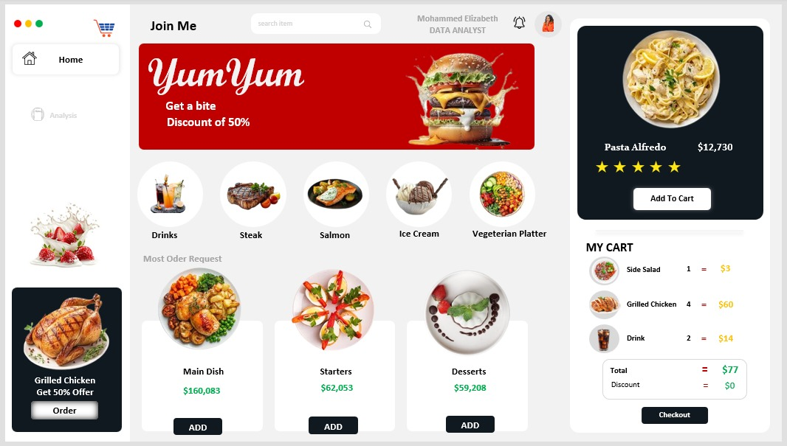
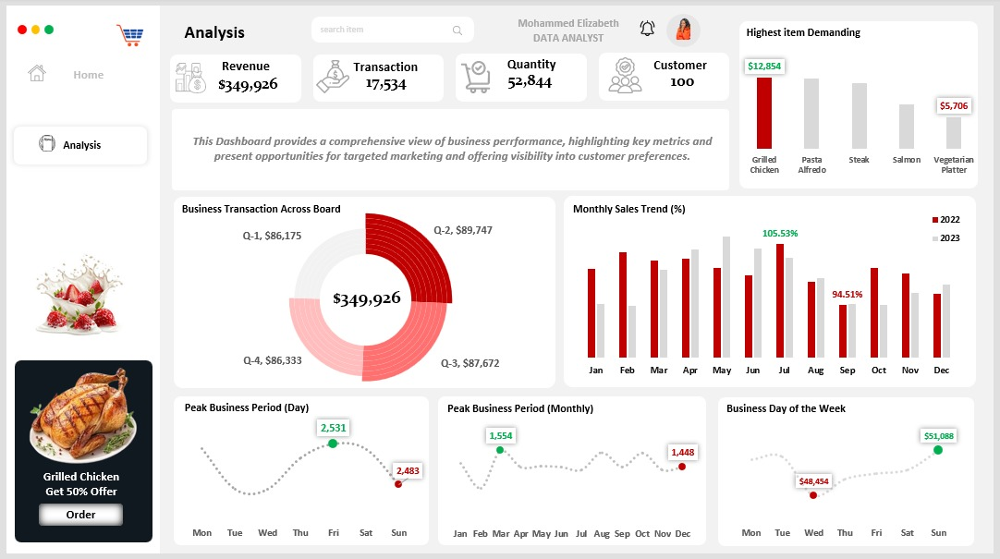
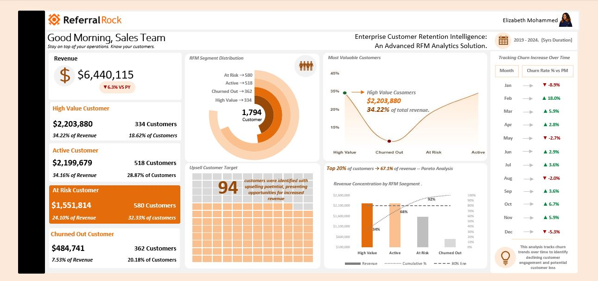

## ABOUT ME

I'm Mohammed Elizabeth, a Data and Insights Analyst and Data Analytics Instructor at HOUSE OF DATA, where I work across two tracks: building analytical solutions that help organizations make smarter decisions, and teaching the next generation of analysts how to think about data the right way.

On the analyst side, I turn raw datasets into structured insights that connect directly to business strategy. My focus is always the same: make sure the people acting on data understand not just what the numbers say, but what they mean and what to do next.
On the instruction side, I teach Excel, Power BI, SQL, and Tableau with an emphasis on real world application over theory, working through real business problems with real data, the same standard I hold my own work to.

I am particularly drawn to executive dashboard development, where the challenge is not just technical but communicative: how do you take hundreds of variables and present them in a way a business leader can read in sixty seconds and walk away knowing exactly where to focus?
That is where I do my best work.

<!--Mention your top/relevant skills here - core and soft skills-->

## Technical Skills

•	**Advanced Excel** — Power Query, Power Pivot, DAX measures, star schema and snowflake modeling, dedicated date tables, PivotTables, conditional formatting, and executive dashboard design

•	**Power BI** — Power Query transformation, DAX measures, data modeling, KPI card design, interactive visuals, and executive dashboard development

•	**SQL** — data extraction, filtering, aggregation, and analysis across relational databases

•	**Tableau** — data visualization, interactive dashboard development, and business performance reporting

•	**Core Analytics** — data cleaning and transformation, KPI development, revenue and profitability analysis, customer segmentation, time series and YoY analysis, gap analysis, and data storytelling

•	**Teaching and Instruction** — data analytics curriculum delivery, practical project based teaching across Excel, Power BI, SQL, and Tableau, and mentoring early stage analysts through real business problems

## Soft Skills

•	**Analytical Thinking** — I look for patterns that are not obvious and connections between metrics that do not show up in a single chart, the kind of findings that actually change how a decision gets made.

•	**Business Acumen** — I frame every analysis around what leadership needs to know, not what is easiest to measure.

•	**Clear Communication** — I translate technical findings into plain language so the audience understands the insight without needing to understand the process behind it.

•	**Attention to Detail** — I verify every figure against source data before it goes anywhere near a stakeholder, because one wrong number can undermine trust in everything else on a dashboard.

•	**Curiosity** — I am always looking for a better query, a cleaner model, or a more intuitive way to present a finding.

<!--Section 2: List 3-4 key projects-->
## MY PROJECTS

**Case Study 1 - Restaurant Sales Intelligence: Customer Demand Analysis, Revenue Optimization, and Seasonal Performance Analytics.**

  

**Tech Stack:** Excel, Power Query, Power Pivot, DAX, Star Schema and Snowflake Modeling, Calculated Columns

Data was transformed using Power Query, then modeled in Power Pivot using a combination of star schema and snowflake schema design, supported by a dedicated date table built for time series analysis. DAX measures and calculated columns powered the KPI cards and the quarterly, monthly, and day of week breakdowns, while PivotTables brought it all together into the dashboard.

**Business Problem**

The restaurant needed visibility into which menu items, days, and time periods drove the most revenue and demand, so leadership could plan staffing, inventory, and promotions around real customer behavior instead of guesswork.

**Executive Summary**

I built a Restaurant Performance Dashboard that tracks revenue, transactions, quantity sold, and customer activity across the year, broken down by menu item, quarter, month, and day of week.

The analysis found $349,926 in revenue across 17,534 transactions and 52,844 items sold, and surfaced clear patterns in which menu items, days, and periods drive the most business.

**Key Insights**

**Revenue and Transaction Baseline**

- Total Revenue: $349,926
- Total Transactions: 17,534
- Total Quantity Sold: 52,844
- Total Customers: 100

Each transaction averages about $19.95 in revenue and roughly 3 items, giving the business a clear baseline to track if average order size or value shifts over time.

**Grilled Chicken Leads Menu Demand**

- Grilled Chicken: $12,854, the highest demand item
- Vegetarian Platter: $5,706, the lowest labeled demand item

Grilled Chicken generates more than double the demand of the Vegetarian Platter, making it the clear anchor item on the menu and a logical focus for the current 50% off promotion shown on the dashboard.

**Revenue Holds Steady Across Quarters**

- Q1: $86,175
- Q2: $89,747
- Q3: $87,672
- Q4: $86,333

Quarterly revenue stays within about $3,600 of each other across the year, with Q2 the strongest and Q1 the weakest, which points to steady demand rather than sharp seasonal swings.

**2023 Outpaced 2022 in July but Fell Behind in September**

- July: 2023 sales reached 105.53% of 2022 levels
- September: 2023 sales fell to 94.51% of 2022 levels

July stands out as the strongest month of growth versus the prior year, while September is the one labeled month where 2023 underperformed 2022, a gap worth digging into since every other labeled month points to growth.

**Friday Drives the Most Transactions, Sunday Drives the Most Revenue**

- Peak Transaction Day: Friday, 2,531
- Lowest Transaction Day: Sunday, 2,483
- Peak Revenue Day: Sunday, $51,088
- Lowest Revenue Day: Wednesday, $48,454

Friday brings in the highest transaction count, but Sunday brings in the highest revenue despite having the lowest transaction count in the week. That gap points to customers spending more per visit on Sundays, likely larger groups, higher priced orders, or both.

**Monthly Transaction Volume Stays in a Narrow Band**

- Highest Month: 1,554 transactions
- Lowest Month: 1,448 transactions

Monthly transaction volume moves within a relatively narrow range across the year, which points to steady month to month demand rather than sharp seasonal spikes.

**Recommendations**

1. Expand the Grilled Chicken promotion or use it as a gateway item to cross sell other menu items, since it already leads demand by a wide margin over items like the Vegetarian Platter.
2. Investigate what changed in September that caused 2023 sales to fall behind 2022, since every other labeled month points to growth.
3. Staff and prep more heavily for Friday given its lead in transaction volume, while reviewing Sunday service for upsell opportunities given its higher revenue despite fewer transactions.
4. Test menu or promotion changes on Wednesday, since it consistently lags the rest of the week on revenue.
5. Test bundling or upsell prompts to lift the average order size beyond its current $19.95 across roughly 3 items per transaction.
6. Track quarterly revenue consistency going forward, since the current spread of about $3,600 between the strongest and weakest quarter suggests stable demand worth protecting rather than seasonal swings worth chasing.
   

**Business Impact Statement**

I built a Restaurant Performance Dashboard in Excel that tracks revenue, transactions, quantity, and customer activity across menu items, quarters, months, and days of the week. The analysis covered $349,926 in revenue across 17,534 transactions, identified Grilled Chicken as the top demand item, and surfaced a meaningful gap between Friday's transaction volume and Sunday's revenue lead. It gives restaurant leadership a clear view of where demand and revenue actually come from, down to the day of the week, instead of relying on instinct alone.

**Case Study 2 - From Customer Data to Retention Strategy: An Enterprise RFM Analytics Solution**

**Tech Stack:** Excel, Power Query, Power Pivot, DAX, PivotTables, Conditional Formatting, Data Modelling, RFM Scoring.

I transfomed the customer data and loaded it using Power Query, then modeled in Power Pivot. RFM scores were calculated using the PERCENTILE function on a 1 to 10 scale for recency, frequency, and monetary value, then combined to classify customers into High Value, Active, At Risk, and Churned segments. DAX measures powered the year over year revenue comparison and the segment level metrics, while PivotTables and conditional formatting were used to build out the dashboard. I also did a data modelling using the star-schema and snowflakes.

**Business Problem**

The business lacked visibility into customer value, churn risk, and revenue concentration, even as overall revenue declined year over year. Leadership needed a clear way to identify high value customers, reduce churn, and uncover growth opportunities through customer segmentation.

**Executive Summary**

Using Excel and the RFM (Recency, Frequency, Monetary) framework, I built a Customer Retention Intelligence Dashboard that analyzed 1,794 customers across a five year period from 2019 to 2024. Total revenue stood at $6.44M, down 6.3% from the prior year. The analysis identified $1.55M in revenue at churn risk, uncovered 94 upsell opportunities, and showed that a small segment of customers drives most of the business's revenue.

**Key Insights**

**Revenue Is Declining Year Over Year**

- Total Revenue: $6,440,115 ($6.44M)
- Year over Year Change: -6.3% vs Prior Year

Revenue fell 6.3% compared to the prior year, the exact trend this RFM analysis was built to explain and reverse.

**High Value Customers Drive a Third of Revenue**

- Revenue: $2.20M
- Customers: 334
- Revenue Contribution: 34.22%

Only 18.62% of customers generate over a third of total revenue, which makes retaining this group a top priority.

**At Risk Customers Carry $1.55M in Exposure**

- Revenue at Risk: $1.55M
- Customers: 580
- Revenue Share: 24.10%

Nearly one third of customers, 32.33% of the base, show signs of declining engagement, creating a real revenue recovery opportunity if they are re engaged before they churn.

**Churn Has Already Cost the Business $484,741**

- Churned Customers: 362
- Revenue Lost: $484,741

More than 20% of customers, 20.18% of the base, have already disengaged, taking nearly half a million dollars in revenue with them.

**Revenue Is Concentrated Among a Small Group**

- Top 20% of customers generate 67.1% of total revenue

The business follows a classic Pareto pattern, which means it depends heavily on a relatively small group of high value customers.

**Upsell Opportunities Exist**

- 94 customers were identified as strong candidates for upselling and cross selling.

These 94 customers already show strong engagement, which makes them the fastest path to additional revenue without acquiring new customers.

**Churn Spiked in February and Eased in January**

- Highest Churn Increase: February (+18.0%)
- Largest Churn Reduction: January (-8.9%)

Churn moves up and down throughout the year, which means retention campaigns need to target specific high risk months rather than running at a constant pace year round.

**Recommendations**

1. Build a VIP retention program for the high value customers who contribute 34.22% of revenue.
2. Launch targeted recovery campaigns for the 580 at risk customers representing $1.55M in revenue.
3. Set up predictive churn monitoring with automated retention alerts.
4. Run personalized upsell campaigns for the 94 high potential customers.
5. Reduce revenue concentration risk by increasing engagement among Active and At Risk customers, the two largest segments outside the High Value group.

**Business Impact Statement**

I built an RFM based Customer Retention Intelligence Dashboard in Excel that segmented 1,794 customers into four groups based on recency, frequency, and monetary value. The dashboard identified $1.55M in at risk revenue, uncovered 94 upsell opportunities, and showed that the top 20% of customers generate 67.1% of total revenue. It gives leadership a clear view of where to focus retention efforts and where revenue is most exposed, backed by segment level evidence rather than guesswork.

**Case Study 3 - Global Revenue Intelligence: Business Performance Analysis for Market Growth, Customer Value, and Product Optimization.**

